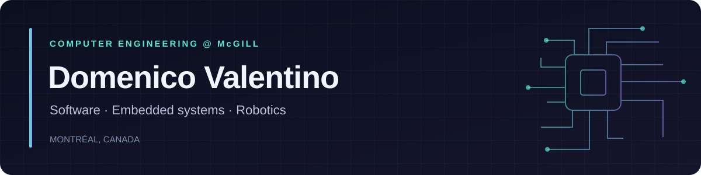

**Building across software and hardware. Co-founder at Kaskaraa Instruments.**

**Summer 2027 internships · Software / Embedded / Robotics**  
Available May–August · Open to relocation

### Selected work

<table>
<tr>
<td width="50%" valign="top">
<h3>🎛️ <a href="https://overcue.gg">OverCue</a></h3>

Public DJ apps and firmware. Stem separation, ARM64 audio systems, and DJM/CDJ control integration.

Rust · C/C++ · React · Tauri · Core ML
</td>
<td width="50%" valign="top">
<h3>🤖 FIRST Robotics</h3>

Led 10 programmers. Competition-deployed autonomous controls, vision localization, and scouting apps.

Java · WPILib · React Native · Firebase

<a href="https://github.com/domilx/TechScout">TechScout</a> · <a href="https://github.com/domilx/TechInsights">TechInsights</a> · <a href="https://www.youtube.com/watch?v=mmGof8gwpak">Competition video</a>

</td>
</tr>
<tr>
<td width="50%" valign="top">
<h3>🔬 <a href="https://kaskaraa.com">Kaskaraa Instruments</a></h3>

Co-founder &amp; software lead. Prototype pathology instruments, motor control, safety logic, AI imaging, and electronics.

Embedded systems · Instrument software · Intern management
</td>
<td width="50%" valign="top">
<h3>🧠 6502 Computer</h3>

Built a working computer from CPU and memory wiring through ROM programming and assembly.

Digital hardware · Assembly · Summer 2026
</td>
</tr>
</table>

### Tools I work with

<b>A little more about my work</b>

- **OverCue:** Implemented much of the software, including desktop components, audio extensions, and DJM knob control of CDJ stems with switching back to regular EQ. External apps handle stem processing. Collaborators contributed equipment testing and related bug fixes.
- **FRC, 2022–2025:** Wrote robot software for teams 3990 and 9406, reviewed pull requests, tested controls, and taught beginners who went on to develop robot control systems.
- **Apple:** Product Specialist, explaining technical products in plain language and serving as a resource for colleagues and customers.

Some projects are closed source for IP and security reasons. Public repositories, product pages, and competition footage provide selected examples of my work.

